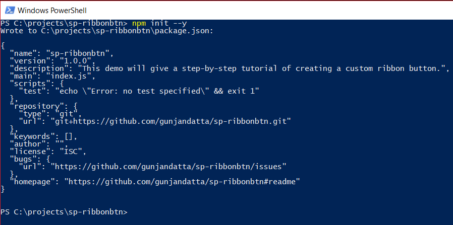

# Create Project

We will be using [Node Package Manage](https://www.npmjs.com/) to manage our libraries.

### Create the project

Create the project folder, and navigate to it in your console. Below is the command to create the project. We will use "--y" to auto-select the default options.

```
npm init --y
```

### Example

